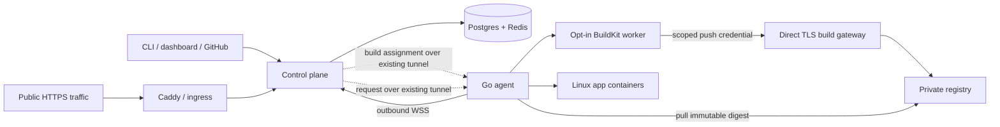

<div align="center">
  

# Fleet OS

### Deploy to the hardware you already own.

An open-source platform for building and running Linux containers across your Macs, Linux machines, and VPSs—even behind NAT.

[Get started](#get-started) · [Architecture](docs/ARCHITECTURE.md) · [Self-hosting](docs/self-hosting.md) · [Documentation](https://fleet.plastikworld.xyz) · [Contribute](CONTRIBUTING.md)

[](https://github.com/YadurajManu/fleet-os/actions/workflows/ci.yml)
[](https://www.npmjs.com/package/@yadurajfleetos/cli)
[](LICENSE)

</div>

Fleet OS connects your machines to one control plane. Declare an app in `fleet.yaml`, deploy with the CLI or a connected GitHub repository, and route public HTTPS traffic through the node's outbound tunnel. Opted-in nodes can build images as well as run them.

**For developers and small teams running apps on hardware they control:** a homelab, an Apple Silicon workstation, or a mix of ARM and x86 machines. You manage the machines, their availability, and their backups; Fleet coordinates builds, placement, and routing.


## What you can do

- **Use machines behind NAT.** Agents open outbound WSS connections; worker nodes need no inbound router port forwarding. Your public control plane and registry still need reachable endpoints.
- **Build on your nodes.** Delegated builds use an opted-in agent's BuildKit worker, with CPU, memory, concurrency, and monitored disk limits. Keep the control-plane Buildx runner as an explicit fallback.
- **Place Linux containers across ARM and x86.** Scheduling uses Docker engine platforms and capacity, image manifests, placement constraints, and reliability. Builders prefer native execution; QEMU fallback is off by default.
- **Keep state where it belongs.** Pin databases and named volumes to their node. Flexible services can be rescheduled when another eligible node exists.
- **Operate from one place.** Inspect placement decisions, deployments, log streams, and node health from the CLI and dashboard. Store runtime and build secrets in Fleet's encrypted secret store.

## Get started

You need a reachable Fleet control plane, a configured registry/ingress, and at least one paired machine running Docker with a **Linux container engine**. To operate your own control plane, start with [self-hosting](docs/self-hosting.md). Windows and macOS use Docker Desktop; native Windows containers are not supported.

### 1. Install the CLI and connect

```sh
npm install -g @yadurajfleetos/cli
fleet auth login
fleet nodes pair
```

The login command uses Fleet's hosted control plane by default. For a self-hosted control plane, run `fleet auth login --api https://fleetapi.example.com` instead. Run the pairing command's generated installer on your node, then confirm it appears with `fleet nodes`. For Windows service installation, follow [agent setup](docs/agent-delegated-builds.md#enable-a-node-as-a-builder).

### 2. Deploy a small app

Create `fleet.yaml` in an empty directory. Change `homelab` to your fleet's name:

```yaml
fleet: homelab
services:
  hello:
    image: nginx:1.27-alpine
    placement: flexible
    container_port: 80
    resources: { ram: 128Mi, cpu: 0.2 }
    health: { path: / }
```

```sh
fleet validate
fleet up --yes
fleet services
fleet open hello
```

This starts with a prebuilt image so you can establish that pairing, scheduling, and routing work before configuring a builder. Fleet prints the service URL; DNS and ingress must be configured for it to be reachable.

### 3. Build your own app

[Enable a builder node](docs/agent-delegated-builds.md#enable-a-node-as-a-builder), including its disk reserve and Buildx prerequisites. Put a Dockerfile in your app directory and replace `image:` with `build: .` in the manifest. Set `container_port` and the health path to match your app.

```sh
fleet apply
fleet deploy hello --yes
fleet logs hello --follow
```

The CLI uploads a build context. A connected GitHub repository uses an exact commit and repository-scoped source credentials. See the [manifest reference](docs/fleet-yaml-spec.md) for databases, secrets, health checks, and placement, and the [build guide](docs/agent-delegated-builds.md) for platform selection and registry setup.

**Release note:** this README describes current main. The npm package and published agent binaries may lag main; the v0.3.0 deployment work has not yet been published as a release. The updated build-log follow path is on main. Check [releases](https://github.com/YadurajManu/fleet-os/releases) before assuming a published CLI or installer contains a new feature.

## How it works



The control plane coordinates durable build jobs and placement. In agent mode, BuildKit runs on the selected node; the control plane retains registry-only manifest inspection/assembly and an optional local-build fallback. Build and runtime nodes may differ.

[Read the architecture →](docs/ARCHITECTURE.md)

## Current status and limits

Delegated builds are implemented on main. A production rollout on one Apple Silicon Mac verified real frontend/API builds, digest-based deployment, scoped registry rejection, a 512 MiB layer push, and cancellation cleanup. **The full release test matrix is unfinished.** The [deployment handover](docs/delegated-builds-handover.md) records evidence and remaining work.

| Area | Current scope |
| --- | --- |
| Linux containers | `linux/amd64`, `linux/arm64`, `linux/arm/v7` platform model |
| macOS agent | Darwin arm64/amd64 builds; Apple Silicon Docker Desktop rollout exercised |
| Linux agent | amd64/arm64/armv7 builds; mixed-node delegated rollout not verified in the latest run |
| Windows agent | amd64 build and service/update implementation; Windows runtime remains unverified |
| Multi-platform builds | Planning and manifest assembly implemented; latest production run used one arm64 builder |
| Availability | Stateful, single-control-plane design; pinned data does not automatically replicate |
| Resource limits | CPU/memory limits plus a monitored disk budget that can briefly overshoot |

Docker Desktop deployments require named volumes and reject bind mounts and host networking. An image for a different architecture is not eligible by default; execution emulation and build-time QEMU fallback are separate opt-ins. The direct build-upload hostname needs working TLS and must avoid proxies with incompatible upload limits.

## Explore the project

| Start here | What it covers |
| --- | --- |
| [Self-hosting](docs/self-hosting.md) | Control-plane installation and networking |
| [Delegated builds](docs/agent-delegated-builds.md) | Builder setup, source/registry credentials, limits, compatibility |
| [fleet.yaml reference](docs/fleet-yaml-spec.md) | Service and database declarations |
| [Architecture](docs/ARCHITECTURE.md) | Components, deployment lifecycle, trust boundaries |
| [CLI](cli/README.md) | Commands and operational workflows |
| [Contributing](CONTRIBUTING.md) | Repository layout and development checks |

## Help build Fleet OS

Try it on a machine you own and tell us what worked—or where setup stopped. Useful contributions include reproducible bug reports, installation improvements, example apps, and hardware verification with exact OS/Docker/agent versions.

- [Report a bug](https://github.com/YadurajManu/fleet-os/issues/new?template=bug_report.yml)
- [Request a feature](https://github.com/YadurajManu/fleet-os/issues/new?template=feature_request.yml)
- [Report hardware compatibility](https://github.com/YadurajManu/fleet-os/issues/new?template=hardware_support.yml)
- [Read contribution guidelines](CONTRIBUTING.md)

Maintained by [Yaduraj Singh](https://github.com/YadurajManu).

If Fleet is useful to you, ⭐ star the repository or watch releases to follow its progress.

<a href="https://www.star-history.com/?repos=YadurajManu%2Ffleet-os&type=date&legend=bottom-right">
  <picture>
    <source media="(prefers-color-scheme: dark)" srcset="https://api.star-history.com/chart?repos=YadurajManu/fleet-os&type=date&theme=dark&legend=bottom-right" />
    <source media="(prefers-color-scheme: light)" srcset="https://api.star-history.com/chart?repos=YadurajManu/fleet-os&type=date&legend=bottom-right" />
    
  </picture>
</a>

## License

[MIT](LICENSE)
