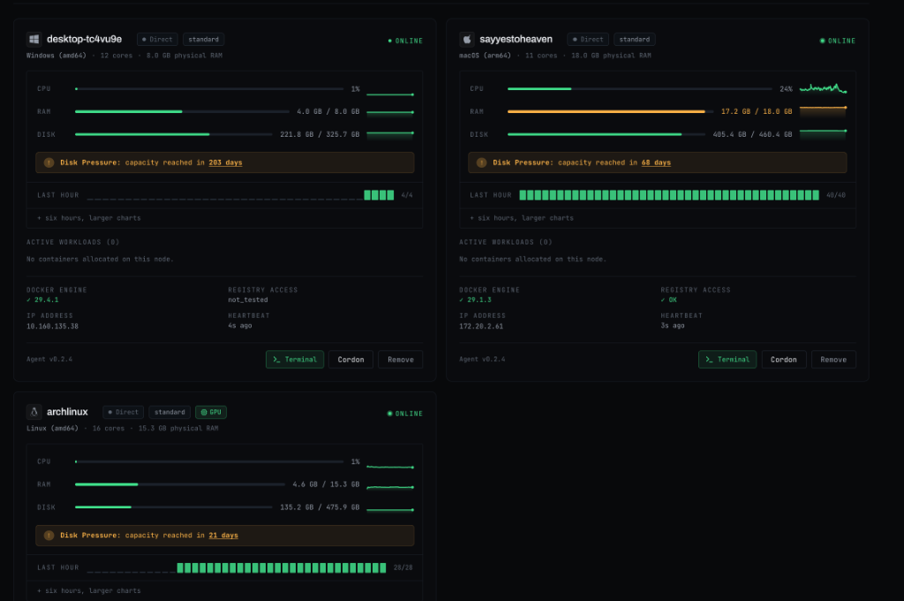
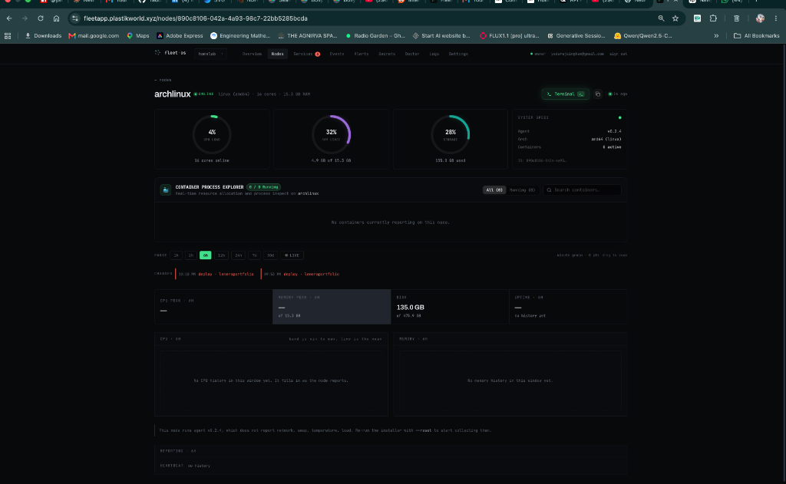
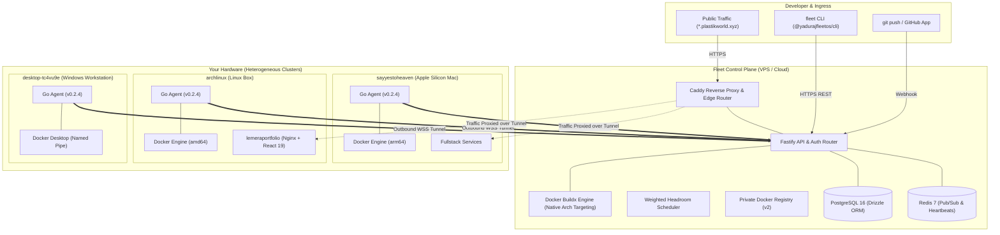

<div align="center">

  

  <br />
  <br />

  # Fleet OS

  **Git push to the hardware you already own.**<br />
  *Turn a Raspberry Pi, an Apple Silicon Mac, an Arch Linux box, and a spare VPS into a unified edge cloud.*

  <br />

  [](https://www.npmjs.com/package/@yadurajfleetos/cli)
  [](LICENSE)
  [](https://go.dev/)
  [](https://nodejs.org/)
  [](https://www.docker.com/)
  [](https://www.typescriptlang.org/)
  [](https://github.com/YadurajManu)

  <br />

  <p align="center">
    <a href="https://fleetapp.plastikworld.xyz"><b>🌐 Live Dashboard</b></a> •
    <a href="https://fleet.plastikworld.xyz"><b>📖 Website</b></a> •
    <a href="docs/ARCHITECTURE.md"><b>🏗️ Architecture</b></a> •
    <a href="docs/fleet-yaml-spec.md"><b>📄 fleet.yaml Spec</b></a> •
    <a href="docs/self-hosting.md"><b>🚀 Self-Hosting</b></a> •
    <a href="#-quickstart"><b>⚡ Quickstart</b></a>
  </p>

</div>

---

## 💡 Why Fleet OS?

Tools like **Coolify**, **Dokploy**, and **CapRover** are fantastic for single-server setups, but their scheduling models assume one stable host or homogeneous servers. **Kubernetes** is extraordinarily complex and demands dedicated infrastructure.

**Fleet OS** is designed from the ground up for **heterogeneous, intermittently connected, real-world hardware**:
- An Apple Silicon Mac (`arm64`), an Arch Linux rig with an NVIDIA GPU (`amd64`), a Windows workstation, and a $4 VPS can live in the same fleet.
- **100% Outbound-Only Zero-Trust Connectivity**: Node agents establish outbound reverse WebSocket tunnels to the control plane. **No open inbound ports, no SSH keys on your machines, and zero router port forwarding** — machines behind residential NAT, university Wi-Fi, or CGNAT are first-class citizens.
- **Architecture-Aware Native Scheduling**: Stateless services are dynamically placed based on real-time headroom and CPU architecture (`arm64` vs `amd64`), while persistent databases stay safely pinned to designated disks.

---

## 📸 Visual Showcase

### 🎛️ Multi-Node Cluster Fleet View
Monitor diverse platforms simultaneously with real-time CPU, RAM, and Disk telemetry, sparklines, and predictive disk pressure warnings:

<div align="center">
  
</div>

<br />

### 🐳 Per-Container Process Explorer & Live Oscilloscope
Track container-level resource consumption, live streaming 2-second oscilloscope metrics, and trigger instant root web terminals or 1-click rolling restarts:

<div align="center">
  
</div>

---

## ✨ Key Features

| Feature | Description |
| :--- | :--- |
| **⚡ Predictive Web Terminal** | In-browser PTY with 0ms perceived latency local echo, debounced window resize, and 1-click root container shell execution (`docker exec`). |
| **📈 Streaming Oscilloscope** | `● LIVE` 2-second telemetry streaming mode with synchronized cross-chart scrubber HUD, drag-to-zoom, and real-time network speedometers. |
| **🐳 Container Explorer** | Full process table reporting container memory MB, host RAM %, CPU load, Docker health check verdicts, and slide-over live log streaming. |
| **🧠 Multi-Arch Build Engine** | Intelligent Docker Buildx runner that targets the exact CPU architecture of the scheduled node (`arm64` or `amd64`), avoiding brittle QEMU emulation. |
| **🔒 Envelope-Encrypted Secrets** | Sensitive environment variables are encrypted at rest using per-secret random DEKs (Data Encryption Keys) wrapped by an organization Master Key. |
| **💾 Volume Snapshots & Databases** | Pin databases (Postgres, Mongo, Redis, MySQL) to dedicated physical disks with scheduled automated backup snapshots and 1-click restore. |
| **🤖 AI Root-Cause Diagnostics** | Integrated AI engine (`fleet diagnose`, `fleet fix`) that analyzes agent telemetry, system events, and container crash logs to prescribe manifest fixes. |
| **🌐 Dynamic Ingress & TLS** | Public HTTPS routing terminating at Caddy / Cloudflare Tunnels, routing seamlessly through reverse tunnels to wherever a container is scheduled. |

---

## 🏗️ System Architecture



> **Zero Inbound Ports**: Every arrow from a physical node points **outward**. The control plane never initiates raw connections to your hardware—it holds persistent reverse WebSocket tunnels, allowing machines behind NAT or dynamic IPs to serve global traffic securely.

---

## ⚡ Quickstart

### 1. Install the CLI
Install the official Fleet CLI via npm:

```bash
npm install -g @yadurajfleetos/cli

# Or run directly without installation:
npx @yadurajfleetos/cli <command>
```

Authenticate with your control plane:
```bash
fleet auth login
```

### 2. Pair a Machine in Seconds
Generate a cryptographically signed, single-use pairing token:

```bash
fleet nodes pair
```
Run the printed one-line curl command on any machine (macOS, Linux, or Windows):
```bash
curl -fsSL https://fleetapi.plastikworld.xyz/install.sh | bash -s -- --token flp_xxxxxxxxxxxx
```
Verify the machine is online:
```bash
fleet nodes
```

---

### 3. Deploy a Fullstack Application
In your repository root (or any directory), let Fleet analyze your project:

```bash
# Generate fleet.yaml with AI-assisted port & environment discovery:
fleet init --ai
```

Example `fleet.yaml` manifest:
```yaml
fleet: homelab

databases:
  db:
    engine: postgres
    node: sayyestoheaven     # Pinned to preserve database volume
    backup: daily

services:
  api:
    build: ./backend
    placement: flexible      # Scheduler places on best node automatically
    container_port: 8000
    resources:
      ram: 512Mi
      cpu: 0.5
    health:
      path: /healthz
    secrets:
      - DATABASE_URL
    uses:
      - db                   # Dependency ordering

  web:
    build: ./frontend
    placement: flexible
    container_port: 80
    resources:
      ram: 256Mi
      cpu: 0.25
    health:
      path: /
    uses:
      - api
```

Apply and roll out the entire stack:
```bash
# Validate manifest syntax:
fleet validate

# Deploy the entire stack in dependency order:
fleet up --yes
```

---

## ⌨️ CLI Command Cheat Sheet

```console
getting started
  up [service]                   Deploy the whole fleet.yaml in dependency order
  init [--ai]                    Scan repository and scaffold fleet.yaml
  import [file]                  Convert a docker-compose.yml into fleet.yaml
  validate [file]                Lint and validate fleet.yaml placement rules
  apply [file]                   Register manifest services into the fleet
  deploy <service>               Build, schedule, and roll out a single service

looking around
  status                         One-screen overview of nodes, resources & services
  nodes                          List all cluster nodes, specs, architecture, status
  services                       List running services, public HTTPS URLs, and nodes
  where <service>                Explain where a service will be placed and why
  tune                           Compare allocated RAM vs actual memory consumed
  logs <service> --follow        Live follow stdout/stderr of container
  events                         Unified cluster event timeline (deploys, restarts)
  open <service>                 Open public service endpoint in default browser

operating
  restart <service>              Rolling zero-downtime container replacement
  reschedule <service>           Force scheduler to evaluate and migrate service
  rollback <service>             Instantly restore previous healthy deployment
  down <service>                 Stop and tear down container workload
  rm <service>                   Permanently delete service declaration
  nodes cordon <name>            Stop scheduling new work onto node
  nodes uncordon <name>          Re-enable scheduling on node
  nodes rm <name> --force        Revoke credentials and remove node from fleet
  unpair                         Safely teardown agent and credentials on local host

state & secrets
  secrets                        List configured secret keys
  secrets set <KEY>              Securely store credential (never echoed in history)
  secrets import [.env]          Import secrets declared in fleet.yaml from .env
  backup <service>               Create on-demand persistent volume snapshot
  backups <service>              List volume backups with timestamp and sizes
  restore <service> [id]         Restore volume snapshot back to container disk
```

---

## 🛠️ Technology Stack

- **Node Agent**: Written in Go (`agent/`). Cross-compiled static binaries for Linux, macOS Darwin, and Windows (`amd64`, `arm64`, `armv7`). Native Docker Engine API client & named pipes.
- **Control Plane**: TypeScript (`control-plane/`). Built on Fastify, Drizzle ORM, PostgreSQL 16, Redis 7, and Docker Buildx.
- **CLI**: TypeScript (`cli/`). Zero-dependency core published as `@yadurajfleetos/cli` on npm.
- **Dashboard**: React 19 + TypeScript + Vite + Tailwind CSS (`dashboard/`). High-performance WebSockets, SVG gauges, and canvas sparklines.
- **Edge Ingress**: Caddy 2 reverse proxy with dynamic TLS and Cloudflare Tunnel integration.

---

## 👨‍💻 Author & Maintainer

Fleet OS is conceptualized, built, and maintained by:

<div align="center">
  <h3><b>Yaduraj Singh</b></h3>
  <p>
    <a href="https://github.com/YadurajManu">GitHub (@YadurajManu)</a> •
    <a href="mailto:yaduraj.enc@gmail.com">yaduraj.enc@gmail.com</a> •
    <a href="https://fleet.plastikworld.xyz/#/founder">Founder Note</a>
  </p>
</div>

---

## 📄 License

Fleet OS is open-source software licensed under the **[MIT License](LICENSE)**. There is no open-core split or paywalled enterprise tier—what is here is the complete product.
