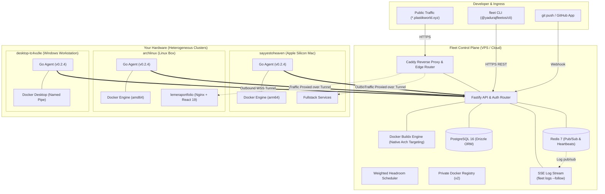

<div align="center">

  <a href="https://fleetapp.plastikworld.xyz">
    
  </a>

  <br />
  <br />

  # Fleet OS

  ### The Open-Source Heterogeneous Cloud Platform
  **Turn an Apple Silicon Mac, a Raspberry Pi, an Arch Linux box, and a spare VPS into a unified edge PaaS.**

  <br />

  <p align="center">
    <a href="https://fleetapp.plastikworld.xyz"><b>🌐 Live Dashboard</b></a> •
    <a href="https://fleet.plastikworld.xyz"><b>📖 Documentation</b></a> •
    <a href="#-quickstart-in-60-seconds"><b>⚡ 60s Quickstart</b></a> •
    <a href="#-fleet-os-vs-alternatives"><b>⚔️ Comparison</b></a> •
    <a href="docs/ARCHITECTURE.md"><b>🏗️ Architecture</b></a> •
    <a href="docs/fleet-yaml-spec.md"><b>📄 fleet.yaml Spec</b></a> •
    <a href="docs/self-hosting.md"><b>🚀 Self-Hosting</b></a>
  </p>

  <p align="center">
    <a href="https://www.npmjs.com/package/@yadurajfleetos/cli"></a>
    <a href="https://github.com/YadurajManu/fleet-os/stargazers"></a>
    <a href="LICENSE"></a>
    <a href="https://go.dev/"></a>
    <a href="https://nodejs.org/"></a>
    <a href="https://www.docker.com/"></a>
    <a href="https://fleetapp.plastikworld.xyz"></a>
  </p>

</div>

---

## 💡 Why Fleet OS?

Tools like **Coolify**, **Dokploy**, and **CapRover** are built for single-server VPS setups or homogeneous Linux fleets. **Kubernetes** is notoriously complex, resource-heavy, and assumes dedicated, uniform datacenter networking.

**Fleet OS** is purpose-built for the hardware developers and homelabbers *actually* have:
- **Heterogeneous Edge Meshes**: An Apple Silicon Mac (`arm64`), a Raspberry Pi (`arm64`), an Arch Linux rig with an NVIDIA GPU (`amd64`), and a $4 cloud VPS join into a single, cohesive compute fabric.
- **100% Outbound Zero-Trust Networking**: Agents maintain persistent outbound reverse WebSocket tunnels to the control plane. **Zero open inbound ports, zero port forwarding, no static public IPs, and no SSH keys stored on servers**. Machines behind residential NAT, university Wi-Fi, or CGNAT are first-class citizens.
- **Architecture-Aware Native Scheduling**: Build and place multi-arch containers natively where they run fastest without brittle QEMU emulation. Pinned volumes guarantee databases stay with their physical disks.

---

## ⚔️ Fleet OS vs. Alternatives

| Feature | **Fleet OS** | **Coolify / Dokploy** | **Kubernetes / K3s** | **Portainer** |
| :--- | :---: | :---: | :---: | :---: |
| **Cluster Target** | **Heterogeneous Edge & Homelab** | Single VPS or Homogeneous Linux | Datacenter & Cloud Clusters | Single Docker Host |
| **Mixed Architectures** | **Native** (`arm64` + `amd64` in 1 fleet) | Limited / Host Dependent | Requires multi-arch CI pipelines | Host Dependent |
| **Network Security** | **100% Outbound Reverse WSS** | Inbound SSH / Open Inbound Ports | Complex Overlay CNI & Ingress | Inbound Agent Port |
| **Behind NAT / CGNAT** | **Plug & Play** (Zero router setup) | Requires Static IP or Cloudflare Tunnel | Complex Ingress / Load Balancers | Requires Direct Route |
| **Agent Overhead** | **~25 MB Go Binary** (< 1% CPU) | Full Docker Compose runtime per host | 1.0 – 2.5 GB RAM Control Plane | ~100 MB Container |
| **Setup Complexity** | **One-line curl (< 30 seconds)** | 10–15 minutes | Hours to Days | 5 minutes |
| **Web Terminal (PTY)** | **Built-in Zero-Latency Browser Shell** | Basic container logs / exec | `kubectl exec` CLI only | Basic Web Console |
| **AI Root-Cause Doctor** | **Built-in (`fleet diagnose`)** | No | Third-party operators | No |

---

## ⚡ Quickstart in 60 Seconds

<table>
<tr>
<td width="33%" valign="top">

### 1. Pair Any Machine
Generate a single-use token and connect hardware behind any firewall or NAT:

```bash
# On your machine:
curl -fsSL https://fleetapi.plastikworld.xyz/install.sh \
  | bash -s -- --token flp_xxxxxxxxxxxx
```

*Runs on macOS, Linux, and Windows.*

</td>
<td width="33%" valign="top">

### 2. Declare Architecture
Scaffold `fleet.yaml` automatically with AI or compose import:

```bash
fleet init --ai
```

```yaml
services:
  api:
    build: ./api
    placement: flexible
  db:
    engine: postgres
    node: sayyestoheaven # Pinned disk
```

</td>
<td width="33%" valign="top">

### 3. Deploy in Order
Validate dependencies, build multi-arch images, and roll out:

```bash
# Build, schedule, and route traffic:
fleet up --yes
```

*Automated health checks, rolling replacements, and live SSE log streams.*

</td>
</tr>
</table>

---

## 💻 Hardware Compatibility Matrix

Fleet OS is verified and tested across a wide spectrum of bare metal and virtualized silicon:

| Platform | Architecture | OS / Kernel | Status |
| :--- | :---: | :---: | :---: |
| **Apple Silicon (M1 / M2 / M3 / M4)** | `arm64` | macOS Darwin 13+ | `● Verified Active` |
| **Raspberry Pi 4 / 5 & Rockchip SBCs** | `arm64` / `armv7` | Debian, Ubuntu, Armbian | `● Verified Active` |
| **Workstations & Gaming Rigs (NVIDIA GPU)** | `amd64` | Arch Linux, Ubuntu, Fedora | `● Verified Active` |
| **Cloud VPS (Hetzner, AWS, DO, Linode)** | `amd64` / `arm64` | Ubuntu 22.04+, Alpine | `● Verified Active` |
| **Windows Workstations** | `amd64` | Windows 11 (Docker Named Pipes / WSL2) | `● Verified Active` |

> Want to verify a new device or SBC? Open a [Hardware Compatibility Report](https://github.com/YadurajManu/fleet-os/issues/new?template=hardware_support.yml).

---

## 📸 Visual Showcase

### 🎛️ Multi-Node Cluster Fleet View
Monitor diverse platforms simultaneously with real-time CPU, RAM, and Disk telemetry, sparklines, and predictive disk pressure warnings:

<div align="center">
  
</div>

<br />

### 🐳 Per-Container Process Explorer & Live Oscilloscope
Track container-level resource consumption, live streaming 2-second oscilloscope metrics, and trigger instant root web terminals or 1-click rolling restarts:

<div align="center">
  
</div>

<br />

### 🕸️ Interactive Cluster Mesh Topology
Real-time topology visualizer showing reverse tunnel health, service satellite placements, and node resource gauges:

```
[ CONTROL PLANE / INGRESS ]
          ▲             ▲
(Reverse WSS)     (Reverse WSS)
          │             │
   [ sayyestoheaven ]  [ archlinux ]
   (Apple Silicon)     (NVIDIA GPU)
     ├─ web-frontend     ├─ ml-inference
     └─ postgres-db      └─ lemera-portfolio
```

---

## 🎯 What's New

- **🔴 Real-Time Log Streaming** — Live tail of container logs via SSE (`fleet logs <svc> --follow`). The agent publishes log lines via outbound WebSocket on every heartbeat; the dashboard subscribes and streams instantly with 0ms polling overhead.
- **🕸️ Collapsible Mesh Topology** — The cluster mesh is now collapsible (320px default → expand to full canvas). Node cards show live container count, tunnel status, and CPU/RAM bars with always-visible service badges.
- **🔒 Security Hardening** — CORS restricted to `PUBLIC_DASHBOARD_URL`, shell injection patched in command execution, webhook bypass secured, httpOnly/SameSite=strict cookie tokens, JWT secret ≥ 32 characters, Redis-based login brute-force rate limiter (10 attempts / 15 min), atomic token refresh preventing replay race conditions.
- **⏪ One-Click Rollback** — `fleet rollback <service>` restores the previous healthy deployment instantly. A new deployment record preserves truthful audit history.

---

## 🏗️ System Architecture



> **Zero Inbound Ports Security Guarantee**: Every arrow connecting physical nodes to the control plane points **outward**. The control plane never initiates inbound connections to your hardware—it holds long-lived reverse WebSocket tunnels, allowing machines behind residential NAT or dynamic IPs to securely serve global ingress traffic.

---

## 📦 Full Installation & Setup

### 1. Install the CLI
Install the official Fleet CLI globally via npm:

```bash
npm install -g @yadurajfleetos/cli

# Or run instantly without installation:
npx @yadurajfleetos/cli <command>
```

Authenticate with your control plane:
```bash
fleet auth login
```

### 2. Pair a Node in Seconds
Generate a cryptographically signed, single-use pairing token:

```bash
fleet nodes pair
```

Run the printed curl command on any target host:
```bash
curl -fsSL https://fleetapi.plastikworld.xyz/install.sh | bash -s -- --token flp_xxxxxxxxxxxx
```

Verify your node is online and reporting telemetry:
```bash
fleet nodes
```

---

<details>
<summary><b>📄 Click to expand Complete fleet.yaml Manifest Example</b></summary>

```yaml
fleet: homelab

databases:
  db:
    engine: postgres
    node: sayyestoheaven     # Pinned to preserve local database volume
    backup: daily

services:
  api:
    build: ./backend
    placement: flexible      # Scheduler places on best node automatically
    container_port: 8000
    resources:
      ram: 512Mi
      cpu: 0.5
    health:
      path: /healthz
    secrets:
      - DATABASE_URL
    uses:
      - db                   # Dependency ordering

  web:
    build: ./frontend
    placement: flexible
    container_port: 80
    resources:
      ram: 256Mi
      cpu: 0.25
    health:
      path: /
    uses:
      - api
```

Validate and roll out:
```bash
fleet validate
fleet up --yes
```

</details>

---

<details>
<summary><b>⌨️ Click to expand Full CLI Command Reference (30+ commands)</b></summary>

```console
getting started
  up [service]                   Deploy the whole fleet.yaml in dependency order
  init [--ai]                    Scan repository and scaffold fleet.yaml
  import [file]                  Convert a docker-compose.yml into fleet.yaml
  validate [file]                Lint and validate fleet.yaml placement rules
  apply [file]                   Register manifest services into the fleet
  deploy <service>               Build, schedule, and roll out a single service

looking around
  status                         One-screen overview of nodes, resources & services
  nodes                          List all cluster nodes, specs, architecture, status
  services                       List running services, public HTTPS URLs, and nodes
  where <service>                Explain where a service will be placed and why
  tune                           Compare allocated RAM vs actual memory consumed
  logs <service> --follow        Live SSE stream of container logs
  logs <service>                 Read the current log tail
  events                         Unified cluster event timeline (deploys, restarts)
  open <service>                 Open public service endpoint in default browser

operating
  restart <service>              Rolling zero-downtime container replacement
  reschedule <service>           Force scheduler to evaluate and migrate service
  rollback <service>             Instantly restore previous healthy deployment
  down <service>                 Stop and tear down container workload
  rm <service>                   Permanently delete service declaration
  nodes cordon <name>            Stop scheduling new work onto node
  nodes uncordon <name>          Re-enable scheduling on node
  nodes rm <name> --force        Revoke credentials and remove node from fleet
  unpair                         Safely teardown agent and credentials on local host

security
  secrets                        List configured secret keys
  secrets set <KEY>              Securely store credential (never echoed in history)
  secrets import [.env]          Import secrets declared in fleet.yaml from .env
  auth login                     Sign in and save secure session
  auth logout                    Sign out and clear session cookies

backup & ops
  backup <service>               Create on-demand persistent volume snapshot
  backups <service>              List volume backups with timestamp and sizes
  restore <service> [id]         Restore volume snapshot back to container disk
  diagnose <question>            AI-powered root-cause analysis
  doctor                         Diagnostic health check across cluster
```

</details>

---

## 🛠️ Technology Stack

- **Node Agent** (`agent/`): Written in pure **Go**. Cross-compiled static binaries for Linux, macOS Darwin, and Windows (`amd64`, `arm64`, `armv7`). Outbound reverse WebSocket tunnels, native Docker Engine client via Unix socket / Windows named pipes, SSE log publisher.
- **Control Plane** (`control-plane/`): Written in **TypeScript / Node.js 24**. Built on Fastify, Drizzle ORM, PostgreSQL 16, Redis 7 (Pub/Sub for real-time log distribution), and Docker Buildx.
- **CLI** (`cli/`): Published as `@yadurajfleetos/cli` on npm. Zero-dependency core, streaming SSE log consumer, and terminal dashboards.
- **Dashboard** (`dashboard/`): React 19 + TypeScript + Vite. Collapsible cluster mesh SVG with live node cards, real-time SSE log tail, telemetry oscilloscopes, and web terminal PTY.
- **Edge Ingress**: Caddy 2 reverse proxy with dynamic TLS and Cloudflare Tunnel integration.

---

## 📈 Stargazers Over Time

[](https://star-history.com/#YadurajManu/fleet-os&Date)

---

## 🤝 Contributing

Contributions are warmly welcomed! Fleet OS is an open project built for the developer community:

1. Look for [`good first issue`](https://github.com/YadurajManu/fleet-os/labels/good-first-issue) or [`help wanted`](https://github.com/YadurajManu/fleet-os/labels/help-wanted) labels.
2. Fork the repository and create a descriptive branch: `git checkout -b feat/my-new-feature`.
3. Check out the [Contribution Guidelines](CONTRIBUTING.md) and [Architecture Guide](docs/ARCHITECTURE.md).
4. Open a pull request against `main`.

<br />

<div align="center">
  <p><b>A huge thank you to all our contributors:</b></p>
  <a href="https://github.com/YadurajManu/fleet-os/graphs/contributors">
    
  </a>
</div>

---

## 👨‍💻 Author & Maintainer

Fleet OS is conceptualized, designed, and maintained by:

<div align="center">
  <h3><b>Yaduraj Singh</b></h3>
  <p>
    <a href="https://github.com/YadurajManu">GitHub (@YadurajManu)</a> •
    <a href="mailto:yaduraj.enc@gmail.com">yaduraj.enc@gmail.com</a> •
    <a href="https://fleet.plastikworld.xyz/#/founder">Founder Note</a>
  </p>
</div>

---

## 📄 License

Fleet OS is open-source software licensed under the **[MIT License](LICENSE)**. There is no open-core split, no enterprise bait-and-switch, and no paywalled features—the repository contains the complete system.
