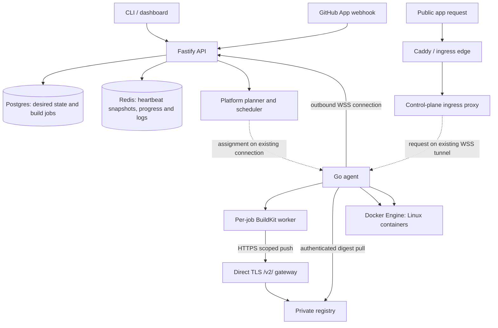

# Architecture

Fleet OS uses a stateful control plane to coordinate Linux containers on user-owned machines. Agents initiate outbound HTTPS and WSS connections, report Docker engine capabilities, and reconcile assigned workloads. Opted-in agents also execute builds. This document describes the implementation on main; deployment verification and release status are separate in the [handover](delegated-builds-handover.md).

## Components and connections



Dashed arrows are messages carried over the connection the agent already opened, not new inbound connections to the worker. The control plane, ingress, and registry need public or otherwise reachable endpoints. Application ingress uses the reverse tunnel when available; a direct reachable node route remains a fallback. NAT traversal is implemented, not a future mesh feature. The current HTTP tunnel encodes request/response bodies; it should not be assumed to provide arbitrary streaming transport.

| Component | Responsibilities | Source |
| --- | --- | --- |
| Control plane | Auth, organizations/fleets, manifests, build orchestration, placement, ingress, audit | `control-plane/src/` |
| Go agent | Engine discovery, heartbeats, tunnels, Docker reconciliation, opted-in builds | `agent/` |
| Postgres | Durable nodes, services, deployments, build attempts, encrypted secrets, audit | `control-plane/src/db/` |
| Redis | Ephemeral heartbeats, progress/log retention and pub/sub | `control-plane/src/api/` |
| CLI/dashboard | API clients, deployment operations, log consumption | `cli/`, `dashboard/` |
| Caddy/registry | TLS ingress and container image storage | `deploy/` |

## Agent registration and platform model

Pairing uses a single-use token; the resulting agent identity is persisted locally. Heartbeats report liveness, runtime diagnostics, containers and capabilities; desired-state polling drives reconciliation. Build messages use the persistent WSS tunnel.

Container platforms come from Docker's `OSType`, `Architecture`, `NCPU`, and `MemTotal`, not the host Go runtime architecture. They normalize to `linux/amd64`, `linux/arm64`, or `linux/arm/v7`. Docker Desktop capacity is the Linux VM's allocation. A Docker engine in Windows-container mode is refused with “Switch Docker Desktop to Linux containers”.

Host executable targets and container platforms are distinct: a Darwin/arm64 agent controls a Linux/arm64 Docker engine. Builds exist for Darwin arm64/amd64, Linux amd64/arm64/armv7, and Windows amd64. Cross-compilation does not establish runtime verification on every OS.

New capability fields are optional for old agents. Agents without build capabilities cannot become builders; their legacy architecture remains available for workload placement compatibility. The schema changes are additive; see migrations 0024, 0025 and 0026 and the [build guide](agent-delegated-builds.md).

## Build orchestration

`deploy.ts` calls the existing `BuildRunner` abstraction. `BUILD_MODE=agent` selects the delegated implementation; `BUILD_MODE=local` retains the control-plane Buildx implementation. Changing the mode requires restarting the control plane. Registry-only `imagetools inspect/create` still run on the control plane in agent mode.

1. Resolve requested platforms. `platforms: auto` uses distinct platforms of healthy, placement-eligible nodes; explicit platform lists are also supported.
2. Create one durable build job per platform. Select an opted-in, connected builder with capacity and a concurrency slot. Native builders are preferred; affinity, capacity, load and reliability influence selection.
3. Reserve resources and assign the job over WSS. Assignment includes the exact source, platform, resource limits, scoped credentials and attempt identity.
4. The agent runs BuildKit, streams build logs, pushes its image, and returns a digest. For multiple platforms, reuse the existing manifest assembly path.
5. Deploy by immutable image digest. Prebuilt `image:` services skip building but still resolve a digest and manifest platforms.

Uploaded CLI contexts use expiring source-download grants and SHA-256 verification. GitHub sources use an exact commit and a fresh repository-scoped installation token. Build inputs include a keyed secret digest for cache identity; successful matching input/platform jobs can reuse a recorded digest. The cache does not currently revalidate images removed externally from the registry.

Jobs carry attempt and node identity, a 45-second lease, renewal every 10 seconds, cancellation and result acknowledgment. Expired attempts can retry up to three attempts total. Node/attempt fencing rejects stale results; restart/orphan handling prevents indefinite running jobs. This uses single-control-plane tunnel ownership, not distributed leader election.

`ALLOW_QEMU_FALLBACK` is disabled by default. If enabled, an amd64 builder can be considered when no native builder exists, with QEMU/binfmt configured separately. This differs from an app's `allow_emulation` setting for runtime placement.

## Registry and source trust boundaries

The dedicated `fleetbuilds.<INGRESS_ZONE>` hostname terminates direct TLS and forwards `/v2/*` to the control-plane registry gateway. Its purpose is to avoid the upload-size limits of a proxied application hostname.

The builder receives a signed, short-lived credential bound to one active job attempt, node and repository. The gateway retains upstream registry credentials, validates job liveness, streams uploads, rewrites upload locations and rejects other repositories and cross-repository blob mounts. Source-download grants cannot be used as push credentials. Finished or expired attempts lose access.

These are build-transfer controls, not a claim that Docker builds safely isolate hostile tenants. Agents have Docker access; opt in trusted machines and trusted source. Registry authentication, TLS, agent credentials and control-plane authorization remain part of the security boundary. General application traffic over WSS and streaming registry uploads are separate paths.

## Builder resource and disk policy

Building is opt-in through `config.json` beside `agent.json`. Defaults: one concurrent build, two CPUs, 2 GiB memory, 20 GiB build disk budget and 10 GiB retained cache. Smaller disk budgets are configurable. Selection accounts for reservations alongside ordinary workload placement.

Preflight requires free space for the build budget plus a reserve of at least 5 GiB or 10% of capacity, whichever is larger. Host and engine filesystems are measured independently; the tighter headroom governs eligibility. Heartbeats report budget, free space and reserve for builder selection.

The agent polls disk use every three seconds. A budget or reserve violation cancels the solve and fails it with a disk-related reason, then prunes scoped cache. Cache retention is separately bounded, including after cancellation. This is a monitored budget, not a hard filesystem quota; it can overshoot between polls. Docker Desktop's VM disk file may grow without automatically shrinking. Fleet does not run a global system/volume prune.

## Workload placement

Placement filters offline/cordoned nodes, image platforms, app constraints, effective CPU/RAM, GPU, tags, reliability tier, pinning, volumes, affinity and anti-affinity. Execution on an incompatible architecture is excluded unless emulation is explicitly allowed. Docker Desktop deployments reject host networking and bind mounts; use named volumes.

Surviving nodes are ranked by headroom, reliability and load with deterministic tie-breaking. `flexible` services can move; `preferred` services favour a node but permit alternatives; `pinned` services stay with their node. A local persistent volume anchors its service. `fleet where` exposes placement candidates and rejection reasons.

## Deployment and rollout

```mermaid
sequenceDiagram
  participant C as CLI / GitHub
  participant P as Control plane
  participant B as Builder agent
  participant R as Gateway / registry
  participant A as Runtime agent
  C->>P: Uploaded context or exact Git commit
  P->>P: Plan platforms and persist jobs
  P->>B: Build assignment over agent-opened WSS
  B->>B: BuildKit solve with resource limits
  B->>R: Scoped image push
  B->>P: Digest, logs and result
  P->>P: Assemble manifest if needed; schedule digest
  A->>P: Poll desired state
  A->>R: Pull immutable digest
  A->>A: Start container and evaluate health
  A->>P: Heartbeat runtime/health evidence
  P->>P: Promote rollout and update ingress
```

Builder and runtime agent may be different nodes. Build logs and bounded container log tails reach Redis/SSE; main's CLI `logs --follow` consumes the stream. One-shot logs read container tails. Published CLI versions may lag this behavior.

During a stateless replacement, the old `running` deployment remains routed while the new one is `deploying`. Health evidence promotes the new deployment and supersedes the old in a transaction. A failed build or an unhealthy replacement leaves the previous healthy release serving. Without a configured health check, promotion uses container running state, which is weaker evidence.

Persistent-volume services replace in place to avoid concurrent writers, so downtime is possible. Rollback is an operational workflow, not a guarantee of instantaneous or zero-downtime replacement. A known CLI issue can report an old running deployment after a new build fails; inspect deployment history for the specific attempt.

## Liveness, failover and operational limits

Redis holds current heartbeat snapshots; persisted timestamps support restart recovery. Offline transitions trigger placement evaluation: flexible services may move to eligible capacity; pinned services report unavailability and remain associated with their data node. Recovery honors the reclaim policy. Local volumes are not automatically replicated by this process.

The architecture is a stateful, single-control-plane design. A control-plane outage interrupts new deployments and can interrupt public ingress, even when Docker containers continue running. Back up Postgres, registry state and the secrets master key; retain known-good images before migrations or deployments.

Self-update is governed by fleet policy and the control plane's published binary/checksum source. The updater currently compares checksums, not semantic versions; an older published binary can replace a newer manually installed binary. Windows uses a helper and previous-executable backup flow, but Windows runtime update verification remains outstanding. Do not infer safe upgrade behavior from version labels alone.

For operator commands and rollout evidence, use the [handover](delegated-builds-handover.md). For configuration, protocol details and recovery planning, use the [delegated-build guide](agent-delegated-builds.md).
